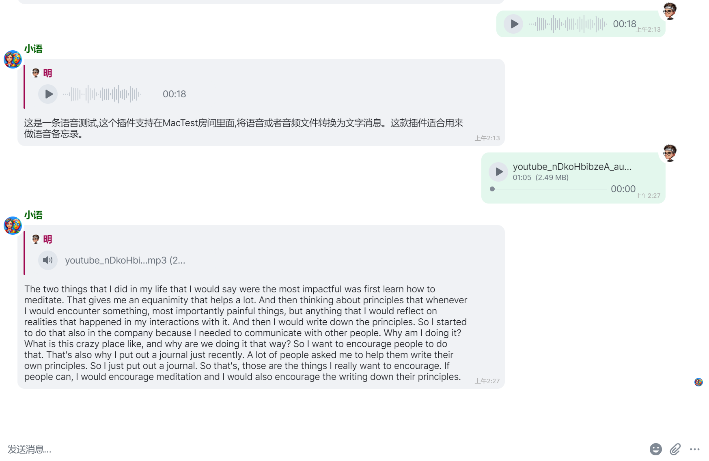

English | [中文](README_ZH.md)

# Whisper Plugin for Maubot

Whisper Plugin is a plugin for Maubot, Support for transcriptions of audio messages to text in Matrix clients using OpenAI's Whisper API

## Features

- Automatically responds to audio and file messages in rooms
- Calls OpenAI Whisper API for audio transcription
- Supports user and room whitelists
- Support reply in thread



## Installation

1. **Clone or download the plugin code**:

    ```bash
    git clone <repository_url>
    cd <repository_directory>
    zip -9r maubot-stt.mbp *
    ```

2. **Configure Maubot**:

    Make sure you have installed and set up Maubot. Refer to [Maubot's official documentation](https://docs.mau.fi/maubot/usage/basic.html) for detailed steps.

3. **Upload the plugin**:

    Upload the plugin in the Maubot management interface.

## Configuration

After uploading the plugin, you need to configure it. Here are the configuration items:

- `api_endpoint`: OpenAI Whisper API endpoint, default is `https://api.openai.com/v1/audio/transcriptions`.
- `openai_api_key`: Your OpenAI API key.
- `allowed_users`: List of users allowed to use this plugin. If empty, all users are allowed.
- `allowed_rooms`: List of rooms allowed to use this plugin. If empty, all rooms are allowed.

### Configuration Example

In the Maubot management interface, go to the plugin's configuration page and fill in the following content:

```json
{
  "api_endpoint": "https://api.openai.com/v1/audio/transcriptions",
  "openai_api_key": "your_openai_api_key",
  "allowed_users": ["@user1:matrix.org", "@user2:matrix.org"],
  "allowed_rooms": ["!roomid:matrix.org"]
}
```

It is recommended to close and reopen the instance configuration after saving.

## Usage
The plugin will automatically listen to messages in the room and perform the following actions upon receiving a voice message or audio file:

1. Download the audio file.
2. Call the OpenAI Whisper API for transcription.
3. Send the transcription result as a text message to the corresponding room.

## License

This project is licensed under the MIT License.